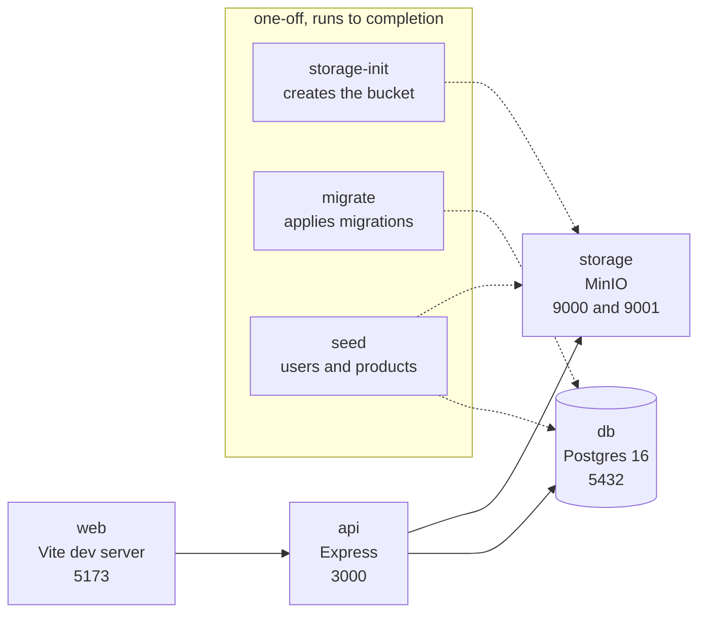
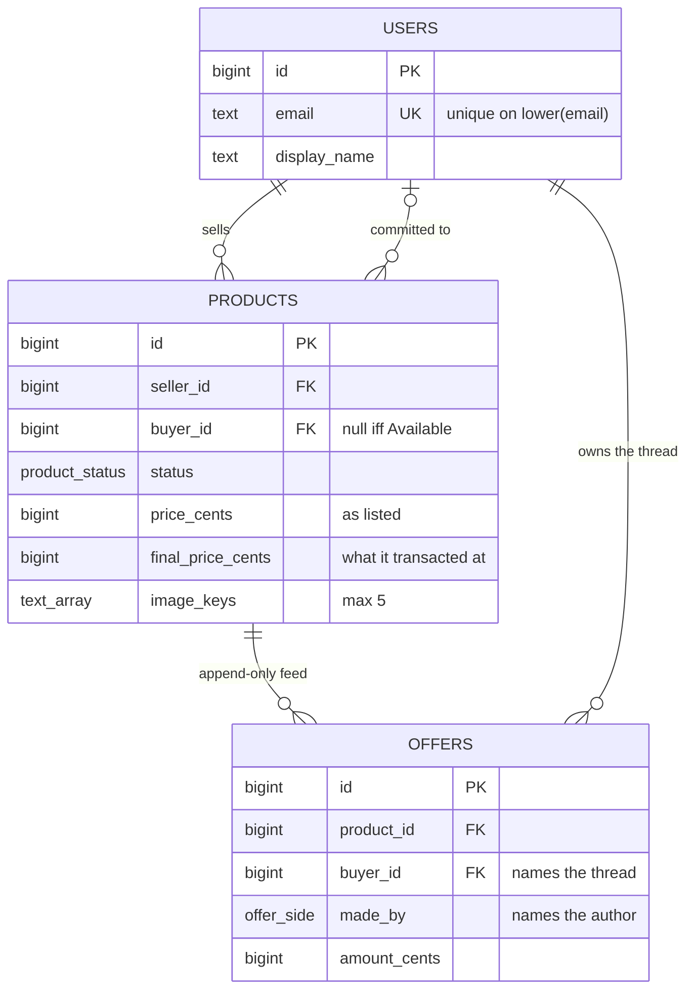
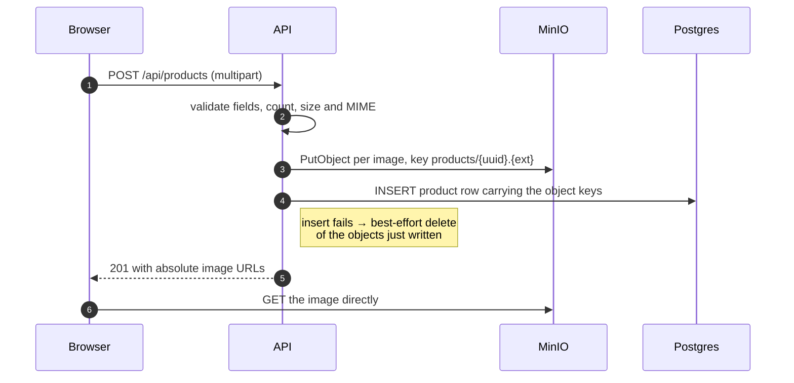
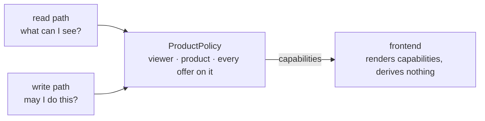
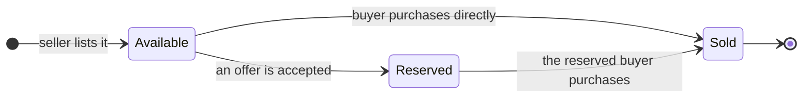

# Architecture

How this repository is put together, how the stack runs, and how purchase and negotiation behave.
The last section covers the way the work was carried out.

---

## 1 · Repo map

An npm-workspaces monorepo with two deployables and one shared package.

| Path | Holds |
| --- | --- |
| `apps/api` | Express 5 + Drizzle. Routes, middleware, services, domain, repositories, storage. |
| `apps/web` | React 19 + Vite + React Query. Pages, components, per-resource API modules. |
| `packages/shared` | The contract: zod schemas and the domain vocabulary. |

**`shared` exists so the two sides never guess at each other's shapes:** every request and response
body, and the status vocabulary, is declared once — as a zod schema or an `as const` tuple — and
imported by the API and the browser alike, with the TypeScript types derived rather than written by
hand.

It is imported by the browser bundle, so it stays free of anything database-flavoured — the Drizzle
schema deliberately stays in `apps/api`.

`apps/api` is layered, and dependencies only point downward:

| Layer | Holds |
| --- | --- |
| `routes/` | Path, middleware chain, status code. No logic. |
| `middleware/` | Authentication, schema validation, upload parsing, error handling. |
| `services/` | Transaction boundaries, refusal → HTTP mapping, response shaping. |
| `domain/` | `ProductPolicy` — every rule. Pure, no I/O, 57 unit tests. |
| `repositories/` | SQL only, one module per table. |
| `db/ storage/ lib/` | Schema, migrations, seed; S3 client; errors, JWT, logging. |

---

## 2 · Infrastructure

`docker compose up` is the entire setup — four long-running services, plus three one-off containers
that run to completion and exit.

> `.env` is committed on purpose so the stack runs on first clone. Every sibling `.env.*` is
> gitignored, so a later file holding real credentials cannot be staged by accident.

---

## 3 · Data model

Three tables. Money is integer cents everywhere, and `status` and `made_by` are native Postgres enum
types, so an unknown value is a type error rather than a rule someone can forget.

**Offers are append-only.** Nothing updates or deletes one, so "newest in this thread" is `max(id)`
and cannot disagree with itself. Keys are `bigint generated always as identity` for exactly that
reason — recency comes from the sequence rather than from a clock.

**`products.buyer_id` is the reservation.** One column names the buyer the product is committed to,
whether that came from an accept or a direct purchase, and two check constraints tie it to the
status: `(status = 'Available') = (buyer_id is null)`, and the same for `final_price_cents`. A
Reserved row with no buyer is not representable, and the accepted offer is derived from the
relationship instead of being stored a second time.

**No thread table.** A thread is created by its first offer and can never exist empty, so a row
would hold nothing its offers do not already imply — the two states it might carry live elsewhere,
since "frozen" is a product-level fact and "whose turn" is the newest offer's `made_by`. The
`(product_id, buyer_id, id desc)` index then serves both hot reads.

**No image table.** Images are written once with the product and carry no metadata of their own, so
an array column costs no join on the most-read page and makes the five-image cap a check constraint
rather than a trigger.

The costs are real but small: an offer's `buyer_id` means *which negotiation*, not *who wrote this*,
which the column names have to work against; and adding image editing later means migrating the
array to a table.

---

## 4 · Images

**Why MinIO.** It speaks the S3 API, and the code talks to it through the AWS SDK rather than a
MinIO-specific one, so moving to real S3 is a configuration change and not a rewrite.

Bytes travel through the API rather than browser-to-storage, which keeps every limit a server
guarantee — at most five images, 5 MB each, and a MIME allowlist.

The database stores **keys**, not URLs — the host is deployment configuration, and a stored URL
would be stale the moment it changed. Responses assemble the URL from a public base that is separate
from the internal endpoint, the same split production has between a private host and a CDN domain.
The bucket is anonymous-read, so those URLs are permanent and browser-cacheable.

---

## 5 · Business rules

Everything the marketplace is allowed to do lives in **one object**. `ProductPolicy` is constructed
from `{ viewer, product, offers }` and answers every question about that product for that viewer.

Read and write call the same methods, so a button and the endpoint behind it cannot disagree.

**Capabilities, not raw state.** The browser never works out that a Reserved product, seen by the
seller, on a superseded offer, means Accept should be hidden. It asks what it can do right now and
renders the answer — the complexity is in knowing which checks apply in which state, and that stays
on one side of the wire. Ids and nullable columns still come back raw: they are facts the UI uses
for wording, not for decisions.

**Every capability is a refusal reason.** Each rule is `refusalToX(): Refusal | null`, and `Refusal`
is an enum whose *value is the wire code*, so one implementation answers both "may I?" and "why
not?" and a refused action names the rule that stopped it.

**Integrity is also in the database.** Six check constraints stand behind the rules, so a service
bug cannot write a nonsense row.

---

## 6 · Lifecycles

### Atomicity

Every write opens a transaction, takes `SELECT … FOR UPDATE` on the product row, re-reads the offers
*inside* that lock, then asks the policy. A competing transaction blocks, then re-reads a world that
has changed — so its own gate refuses it, naming the rule.

The lock is on `products` alone, never across a join — locking the seller's row too would serialise
purchases across everything that seller lists. The smoke suite covers three races, each asserting
exactly one winner without asserting *which*.

---

## 7 · API surface

| Endpoint | Does |
| --- | --- |
| `POST /api/auth/login` | Credentials for a 24-hour bearer token. |
| `GET /api/me` | The signed-in user, re-read from the database each request. |
| `GET /api/products` | Card list — one image, no description. |
| `POST /api/products` | Creates a listing with up to five images. |
| `GET /api/products/:id` | Detail, including this viewer's capability flags. |
| `POST /api/products/:id/purchase` | Settles the product as `Sold`. |
| `GET /api/products/:id/offers` | Every thread interleaved, with per-row flags. |
| `POST /api/products/:id/offers` | Opens a thread, or counters an offer. |
| `POST /api/offers/:id/accept` | Reserves the product for that offer's buyer. |
| `GET /health` | Proves Postgres and object storage are reachable. |

A refused action returns the specific rule that stopped it, never one generic code per endpoint:

| Code | Raised by | Means |
| --- | --- | --- |
| `OWN_PRODUCT` | purchase, offer | You are the seller. |
| `PRODUCT_NOT_AVAILABLE` | purchase, offer, accept | Already reserved or sold. |
| `NEGOTIATION_OPEN` | purchase | You have a live thread on this product. |
| `THREAD_ALREADY_OPEN` | offer (opening) | You already opened one here. |
| `OFFER_SUPERSEDED` | offer, accept | A newer offer exists in that thread. |
| `NOT_YOUR_TURN` | offer, accept | The other side holds the turn. |

---

## 8 · How this was built

Four documents, each holding one kind of thing, written before the code they describe.

| Document | Holds |
| --- | --- |
| `requirements.md` | The canonical spec. Where anything disagrees with it, it wins. |
| `tasks.md` | 28 tickets — user story, acceptance criteria, QA steps, dependencies, estimate. |
| `wireframes.md` | Screen-by-screen layouts, UI states, and button-visibility rules. |
| *decision log* | A running record of every technical and UX decision, kept alongside the work. |

The loop per ticket: agree the approach, record what was decided and what was rejected, implement,
then run the ticket's QA steps by hand. A ticket reaches `Done` only once that QA has actually been
run, and its status line records the date and anything left unverified.

**Build order.** The backend first as one batch — schema, seed and Compose, auth, product CRUD, the
negotiation engine, the read model — then the frontend run from login through to the negotiation
history. Each ticket is its own reviewable commit.

The decision log is a working document and is not published with the repo. It holds around a hundred
entries — every choice above, the alternatives weighed against it, and the rulings later reversed.

### Tests

| Command | Covers |
| --- | --- |
| `npm test` | 57 unit tests over `ProductPolicy`, plus 11 over the browser's pure modules. No stack required. |
| `npm run test:smoke -w @linkby/api` | 22 HTTP tests against a running stack, including the three race conditions. |

Neither substitutes for the other: every ticket was also walked through in a browser, or with `curl`
against the running API where there was no UI yet.
