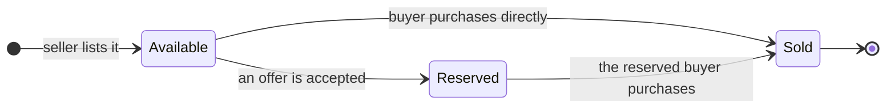
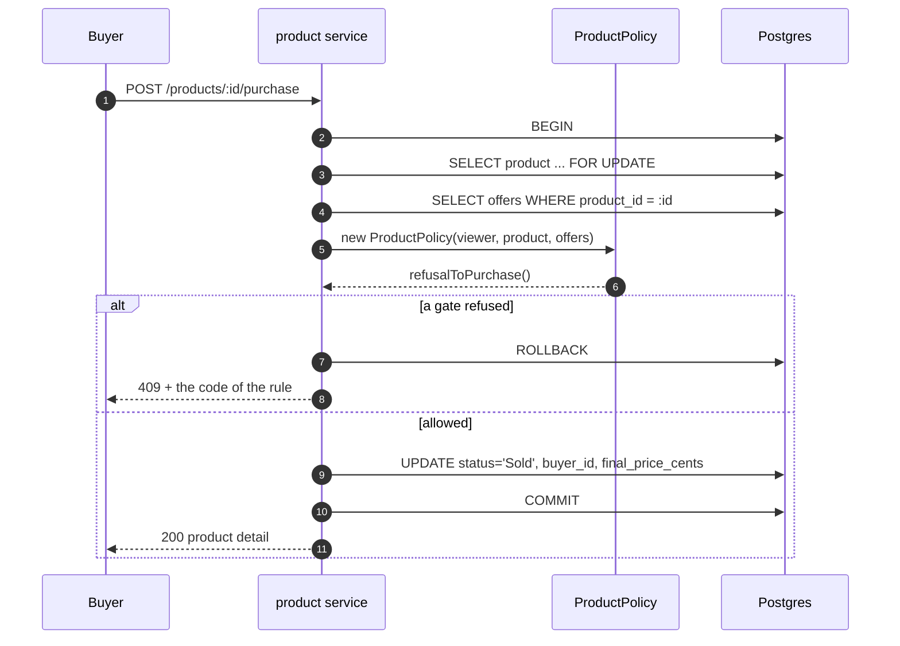
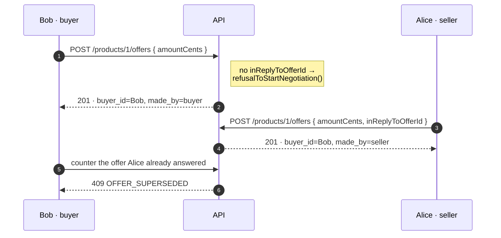
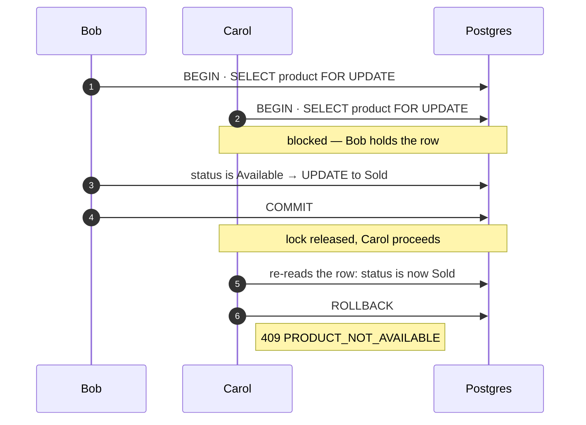

# Architecture

How the API is layered, and how purchase, negotiation and reservation run. This file describes what
exists, not why it was chosen over the alternatives.

---

## Layers

npm-workspaces monorepo. `packages/shared` holds the contract — zod schemas plus the domain
vocabulary that feeds Drizzle's `pgEnum`, zod's `z.enum` and the TypeScript unions at once, so the
database, API and browser cannot drift.

`apps/api` is layered, and dependencies only point downward:

| Layer           | Holds                                                              |
| --------------- | ------------------------------------------------------------------ |
| `routes/`       | Path, middleware chain, status code. No logic.                     |
| `middleware/`   | Authentication, schema validation, upload parsing, error handling. |
| `services/`     | Transaction boundaries, refusal → HTTP mapping, response shaping.  |
| `domain/`       | `ProductPolicy` — every rule. Pure, no I/O, 53 unit tests.         |
| `repositories/` | SQL only, one module per table.                                    |
| `db/ storage/ lib/` | Schema, migrations, seed; S3 client; errors, JWT, logging.     |

**One object owns every rule.** `ProductPolicy` is built from `{ viewer, product, offers }` and
answers all of them. The read path (the detail response's `viewer` block, the history's per-row
flags) and the write path (refusal checks) call the same methods, so a button and its endpoint
cannot disagree.

**Refusals carry their own wire code.** Each rule is an enum member whose value *is* the code the
caller receives (`NotAvailable = 'PRODUCT_NOT_AVAILABLE'`), mapped to a message through an
exhaustive record — adding a rule is a compile error until it has one. `canPurchase` is
`refusalToPurchase() === null`, so one implementation answers both "may I?" and "why not?".

**Integrity is also in the database.** Six check constraints, including
`(status = 'Available') = (buyer_id is null)` and the same for `final_price_cents`. A service bug
cannot write a nonsense row.

---

## Lifecycle



`price_cents` stays what the seller advertised for the life of the row. What the product transacted
at goes to `final_price_cents`, so a negotiated settlement leaves both readable.

---

## Purchase

`POST /api/products/:id/purchase`. Gates run in order, least recoverable first:

1. Not the seller — else `OWN_PRODUCT`.
2. Reserved for you? Then buy it. The one disjunction; it bypasses both gates below.
3. Product is `Available` — else `PRODUCT_NOT_AVAILABLE`.
4. You have no open thread — else `NEGOTIATION_OPEN`. Negotiating gives up the original price.

The charge is `final_price_cents ?? price_cents`, published to the browser as
`viewer.purchasePriceCents` so the button's label cannot drift from it.



---

## Negotiation

Offers form one flat chronological feed per product, visible to everyone. Two columns give it
structure: **`buyer_id` names the thread, `made_by` names the author** — so a seller's counter still
carries the buyer's id. That pairing lets one ordered list hold several two-party conversations.

Each buyer has at most one thread per product. The seller has no such limit, which is why two buyers
can genuinely race to accept.

Turn rules, applied to both countering and accepting:

1. Product is `Available` — else `PRODUCT_NOT_AVAILABLE`.
2. This offer is newest in its thread — else `OFFER_SUPERSEDED`.
3. It is your side's turn — else `NOT_YOUR_TURN`. The seller may answer any buyer's offer in any
   thread; a buyer may answer only the seller, only in their own thread.

`POST /api/products/:id/offers` without `inReplyToOfferId` opens a thread; with one, it counters that
offer. Same act to the caller, and the thread follows from the offer rather than being asserted.



`GET /api/products/:id/offers` costs one query regardless of size — the buyer's display name is
joined onto the offer row, not looked up per row. Each row carries `isLatestInThread` and
`canRespond`, so the browser holds no copy of the turn rules.

---

## Reservation

`POST /api/offers/:id/accept`. The offer id names the thread, so both sides send the same request.
Accept and Counter share the gates above and one `canRespond` flag, because in the UI they appear and
disappear together.

Accepting does not sell. It moves the product to `Reserved`, writes the accepted buyer and amount,
and leaves the final step to that buyer. Every other buyer's controls go dead.

```mermaid
sequenceDiagram
    autonumber
    participant Seller
    participant Service as offer service
    participant Policy as ProductPolicy
    participant DB as Postgres

    Seller->>Service: POST /offers/7/accept
    Service->>DB: SELECT offer 7
    Note right of Service: unlocked — offers are immutable;<br/>what varies is re-read inside the lock
    Service->>DB: BEGIN
    Service->>DB: SELECT product ... FOR UPDATE
    Service->>DB: SELECT offers (fresh, inside the lock)
    Service->>Policy: refusalToRespond(offer 7)

    alt superseded, wrong turn, or not Available
        Service->>DB: ROLLBACK
        Service-->>Seller: 409 + the code of the rule
    else allowed
        Service->>DB: UPDATE status='Reserved',<br/>buyer_id, final_price_cents
        Service->>DB: COMMIT
        Service-->>Seller: 200 product detail
    end
```

No field says "accepted". A client derives it: latest in its thread, its thread's buyer equals the
product's `buyer_id`, and the status has moved past `Available`.

---

## Atomicity

All three flows share one shape. Each opens a transaction, takes `SELECT … FOR UPDATE` on the product
row, re-reads the offers *inside* that lock, then asks the policy. A competing transaction blocks,
then re-reads a world that has changed — so its own gate refuses it, naming the rule.



Three races are covered by the smoke suite, each asserting exactly one winner without asserting
*which*: ten simultaneous purchases, simultaneous accepts on two threads, and a purchase racing an
accept.

---

## Surface

| Endpoint | Does |
| --- | --- |
| `POST /api/auth/login` | Credentials for a 24-hour bearer token. |
| `GET /api/me` | The signed-in user, re-read from the database each request. |
| `GET /api/products` | Card list — one image, no description. |
| `POST /api/products` | Creates a listing with up to five images. |
| `GET /api/products/:id` | Detail, including this viewer's capability flags. |
| `POST /api/products/:id/purchase` | Settles the product as `Sold`. |
| `GET /api/products/:id/offers` | Every thread interleaved, with per-row flags. |
| `POST /api/products/:id/offers` | Opens a thread, or counters an offer. |
| `POST /api/offers/:id/accept` | Reserves the product for that offer's buyer. |
| `GET /health` | Proves Postgres and object storage are reachable. |

A refused action returns the specific rule that stopped it, never one generic code per endpoint:

| Code | Raised by | Means |
| --- | --- | --- |
| `OWN_PRODUCT` | purchase, offer | You are the seller. |
| `PRODUCT_NOT_AVAILABLE` | purchase, offer, accept | Already reserved or sold. |
| `NEGOTIATION_OPEN` | purchase | You have a live thread on this product. |
| `THREAD_ALREADY_OPEN` | offer (opening) | You already opened one here. |
| `OFFER_SUPERSEDED` | offer, accept | A newer offer exists in that thread. |
| `NOT_YOUR_TURN` | offer, accept | The other side holds the turn. |

---

## Tests

| Command | Covers |
| --- | --- |
| `npm test` | 53 unit tests over `ProductPolicy`. No stack required. |
| `npm run test:smoke -w @linkby/api` | 16 HTTP tests against a running stack (`docker compose up -d`). |
